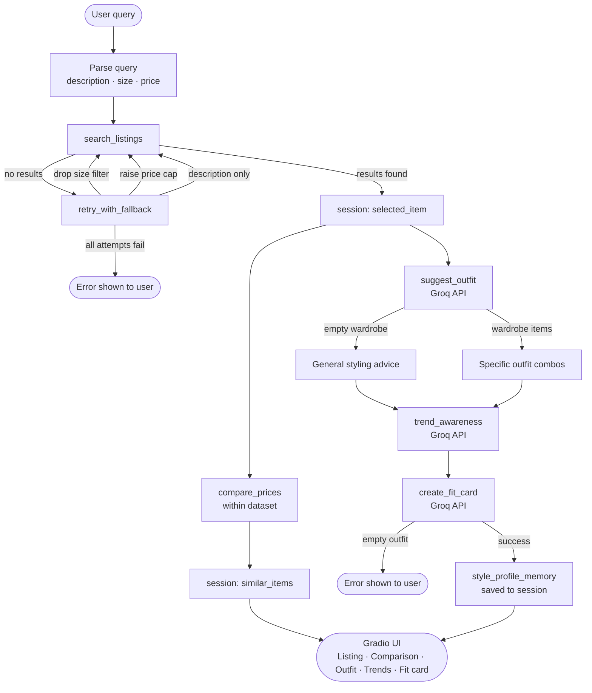

# TakeMeter
TakeMeter is  a fine-tuned text classifier that evaluates discourse quality in an online community. 

---

## How it works



---

## Tools

| Tool | API | Purpose |
|---|---|---|
| `search_listings` | None | Keyword + filter search against the mock dataset |
| `compare_prices` | None | Finds similar items within 120% of the selected item's price |
| `suggest_outfit` | Groq | Suggests outfit combinations using the user's wardrobe |
| `trend_awareness` | Groq | Generates trend context based on the item's style tags |
| `create_fit_card` | Groq | Writes an Instagram-style OOTD caption |
| `retry_with_fallback` | None | Progressively loosens filters when no results are found |

**NB:** - OOTD stands for Outfit-of-the-day
---

## Planning loop

The agent does not call all tools in a fixed sequence. `run_agent()` in `agent.py` branches based on the result produced with each tool returns:

1. **Parse** the user's natural language query input into `description`, `size`, and `max_price` using regex.
2. **Call `search_listings`**. If it results in an empty list, calls `retry_with_fallback` instead of continuing.
3. **`retry_with_fallback`** attempts three progressively looser searches — drop size filter, raise price cap by 25%, then description-only. If all three fail, the agent sets `session["error"]` and returns early. `suggest_outfit` is never called with empty input.
4. **Select the top result** and store it in `session["selected_item"]`.
5. **Call `compare_prices`** and `suggest_outfit` in parallel off the same selected item.
6. **Call `trend_awareness`** with the selected item.
7. **Call `create_fit_card`** with the outfit suggestion. If the outfit string is empty, return an error message instead of calling the LLM.
8. **Save to `style_profile_memory`** and return the completed session.

---

## State management

All state lives in a single session dict initialized at the start of each `run_agent()` call. Every tool writes its output into a named key, and subsequent tools read from those keys — the user never re-enters information between steps.

```python
session = {
    "query": str,               # original user query
    "parsed": dict,             # description, size, max_price
    "search_results": list,     # all matching listings
    "selected_item": dict,      # top result → passed into suggest_outfit
    "wardrobe": dict,           # user's wardrobe → passed into suggest_outfit
    "similar_items": list,      # output of compare_prices
    "outfit_suggestion": str,   # output of suggest_outfit → passed into create_fit_card
    "trend_info": str,          # output of trend_awareness
    "fit_card": str,            # output of create_fit_card
    "fallback_message": str,    # set if retry_with_fallback loosened any filters
    "error": str | None,        # set on early exit; None on success
}
```

---

## Error handling

Every tool handles its own failure mode and never crashes the agent.

| Tool | Failure mode | Behavior |
|---|---|---|
| `search_listings` | No keyword match | Returns `[]` |
| `search_listings` | Price/size excludes all | Returns `[]` |
| `search_listings` | File load error | Catches exception, returns `[]` |
| `compare_prices` | No same-category items | Returns `[]` |
| `compare_prices` | File load error | Catches exception, returns `[]` |
| `suggest_outfit` | Empty wardrobe | Switches to general styling advice prompt |
| `suggest_outfit` | API failure | Returns a friendly error string |
| `trend_awareness` | API failure | Returns a friendly error string |
| `create_fit_card` | Empty outfit string | Returns error message without calling LLM |
| `create_fit_card` | API failure | Returns a friendly error string |
| `retry_with_fallback` | All attempts fail | Returns `{"results": [], "message": "..."}` |

There are two places the agent exits early with an error shown to the user:
- After `retry_with_fallback` finds nothing — `session["error"]` is set and `suggest_outfit` is never called.
- If `create_fit_card` receives an empty outfit string — returns a descriptive message instead of an LLM call.

---

## Project structure

```
fitfindr/
├── agent.py              # Planning loop and session management
├── app.py                # Gradio UI
├── tools.py              # All six tools
├── requirements.txt
├── data/
│   ├── listings.json     # 40 mock secondhand listings
│   └── wardrobe_schema.json
├── utils/
│   └── data_loader.py    # load_listings(), get_example_wardrobe(), get_empty_wardrobe()
└── tests/
    └── test_tools.py     # 41 pytest tests covering every failure mode
```

---

## Setup

```bash
# 1. Clone the repo and install dependencies
pip install -r requirements.txt

# 2. Add your Groq API key
echo "GROQ_API_KEY=your_key_here" > .env

# 3. Run the app
python app.py 
py app.py (VS Code)
```

Then open the localhost URL shown in your terminal (usually `http://localhost:7860`).

---

## Running tests

```bash
pytest tests/ -v
```

41 tests covering every tool's failure modes — no API key required, all LLM calls are mocked.

---

## Example queries

| Query | What it tests |
|---|---|
| `vintage graphic tee under $30` | Happy path — description + price filter |
| `90s track jacket in size M` | Happy path — description + size filter |
| `flowy midi skirt under $40` | Happy path — category keyword |
| `black combat boots size 8` | Happy path — shoes category |
| `designer ballgown size XXS under $5` | No-results path — triggers full fallback |

---
## Video Demo
[Demo Video](https://youtu.be/EDhRE7JD9E8)
