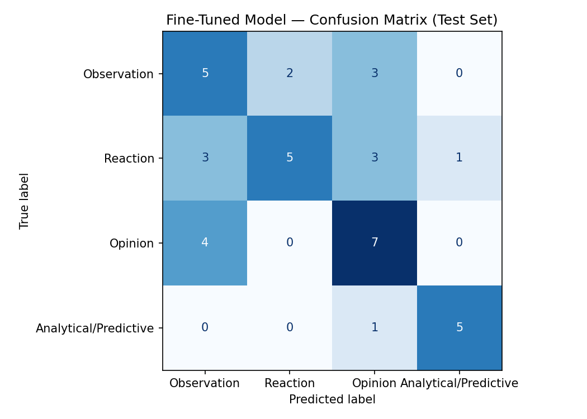

# TakeMeter

TakeMeter is a fine-tuned text classifier that evaluates discourse quality 
on the current World Cup 2026 Reddit communities. It classifies comments into four 
categories — Observation, Reaction, Opinion, and Analytical/Predictive — 
capturing meaningful distinctions in how fans engage with the sport. The 
classifier was built by collecting and annotating 260 Reddit comments, 
fine-tuning DistilBERT on the labeled dataset, and comparing performance 
against a zero-shot Llama baseline.

---

## Data Source

Data was collected manually from r/worldcup during the ongoing 2026 FIFA World Cup. Comments were drawn from four thread types: discussion, pre-match, match, megathread, and post-match threads. Match threads were the primary source, for they naturally contain the full spectrum of comment types within a single thread.

Comments were selected manually by reading through threads and including comments that clearly fit one of the four label categories. Comments that were crude, spam, or too ambiguous to label confidently were excluded. Comments used includes misspellings, abbreviations and slang. All comments are in English.Comment

---

## Labeling Process

Comments were labeled manually by a single annotator. The labeling process 
involved two passes:

1. **Collection pass** — comments were copied into a CSV file with metadata 
   (source subreddit, thread type, thread URL) and no label assigned.
2. **Annotation pass** — each comment was assigned one of four labels based 
   on the definitions and decision rules documented below.

After an initial labeling pass, label definitions were refined based on patterns observed in the data. For instance, the original "Contextual" label was redefined as "Analytical/Predictive" to better capture the forward-looking reasoning pattern it was intended to identify. All 220 original comments were re-labeled from scratch after the definitions were 
finalized ensuring consistency. An additional 40 Analytical/Predictive comments were collected in a targeted pass to address class imbalance. The total number of comments used is 260.

---

## Label Taxonomy

**Observation**
A comment that states a factual or descriptive claim without taking a position, providing reasoning, or expressing emotion. The speaker reports what they see or experience neutrally.

**Opinion**
A comment that takes a clear stance and provides reasoning or justification to support it. References and comparisons serve as supporting evidence for an argument or conclusion.

**Reaction**
A comment that expresses an emotional or visceral response to a match event, decision, or situation. Minimal reasoning is provided; the emotion itself is the primary substance.

**Analytical/Predictive**
A comment that uses statistics, standings, tactical reasoning, or logical if/then thinking to analyze a current situation or predict an outcome. The analysis or prediction is the primary substance.

### Decision Rules
- If a comment uses numbers or standings to reason toward a conclusion or 
  prediction → Analytical/Predictive
- If a comment uses a reference or comparison to argue a point → Opinion
- If a comment states something without argument or prediction → Observation
- If the emotion is the point and reasoning is absent or minimal → Reaction
- Counterfactual language ("had X happened, Y would have been different") 
  → Opinion, not Analytical/Predictive
- Tone (aggressive, humorous, warm) does not determine the label, the underlying structure does
- When in doubt between Opinion and Analytical/Predictive, ask: is the 
  comment reasoning toward a conclusion using data/tactics, or expressing 
  a stance based on values/preferences?

---

## Label Count Distribution

| Label | Count | Percentage |
|-------|-------|------------|
| Observation | 65 | 25.0% |
| Reaction | 83 | 31.9% |
| Opinion | 71 | 27.3% |
| Analytical/Predictive | 41 | 15.8% |
| **Total** | **260** | **100%** |

### Train / Validation / Test Split (70/15/15, stratified)

| Label | Train | Validation | Test |
|-------|-------|------------|------|
| Observation | 45 | 10 | 10 |
| Reaction | 58 | 13 | 12 |
| Opinion | 50 | 10 | 11 |
| Analytical/Predictive | 29 | 6 | 6 |
| **Total** | **182** | **39** | **39** |

---

## Example Labels

**Observation:**
- "where some of the countries fans can't get visa to support their teams 
  kinda unfair for them"
- "Could be most of the stadiums are huge bowls. Not even a hint of roof 
  or cover, maybe the sound is just getting lost."

**Reaction:**
- "No thank you"
- "With those ticket prices? Great way to completely ruin it"

**Opinion:**
- "Anywhere can host it. We don't need 48 teams and we don't need 80000 
  seat stadiums charging a fortune. An affordable world cup for fans would 
  be far preferable to this, enough money is made off tv deals that we 
  don't need big expensive venues."
- "The ambience has been meeeh at most, we have been in 3 games and only 
  yesterday's match between Netherlands and Sweden had an OK vibe; have 
  you seen the ambience in Mexico? That is where the whole cup should've 
  go to"

**Analytical/Predictive:**
- "Isn't it risky to aim for 3rd? Not every 3rd place is making it out 
  of group. Second place is a death sentence for us so our only hope is 
  to destroy Haiti while Brazil struggle against Scotland, and honestly I 
  don't see us scoring many goals."
- "Either would have 4 points with a win, which would most likely be good 
  for at least second, but Iran and Belgium both have 2 points now so it's 
  a very close group, hard to tell who will go through tbh"

---

## Difficult Labeling Examples

**Edge Case 1: Reaction vs. Observation**
*"HOW WAS THAT NOT A PK??? Sorry for yelling"*
Could be Observation (reacting to a visible play) or Reaction (emotional 
outburst). Labeled **Reaction** — the all-caps phrasing and explicit 
acknowledgment of yelling confirms emotion is the primary substance.

**Edge Case 2: Analytical/Predictive vs. Opinion**
*"Either would have 4 points with a win, which would most likely be good 
for at least second, but Iran and Belgium both have 2 points now so it's 
a very close group, hard to tell who will go through tbh"*
Uses standings data but reaches a conclusion ("hard to tell who will go 
through"). Labeled **Analytical/Predictive** — the points math is driving 
a prediction, not supporting a normative argument.

**Edge Case 3: Opinion vs. Observation**
*"Anywhere can host it. We don't need 48 teams and we don't need 80000 
seat stadiums charging a fortune."*
Opens with a neutral-sounding claim but shifts into normative argument 
("far preferable"). Labeled **Opinion** — "we don't need" signals 
prescriptive intent, not neutral description.

**Edge Case 4: Opinion vs. Reaction vs. Analytical/Predictive**
*"Turkish football has been rocked by match fixing and corruption... 
Montella selected players he favored regardless of their form... 
I'm not even mad after 22 years, just sad."*
Contains emotional language (Reaction), tactical observations 
(Analytical/Predictive), and factual references (Observation). Labeled 
**Opinion** — the comment builds a structured causal argument about why 
Turkey failed using multiple supporting reasons.

**Edge Case 5: Reaction vs. Analytical/Predictive**
*"As an Egyptian fan, I have to admit this is peak self-awareness 😂. 
If Egypt somehow makes it out of the group this time, this video is going 
to age horribly."*
Casual humor and emoji suggest Reaction, but the substance is explicit 
conditional reasoning mapping two outcomes. Labeled 
**Analytical/Predictive** — tone does not override underlying structure.

**Edge Case 6: Reaction vs. Analytical/Predictive**
*"Really genius? So with 12 teams all vying for 8 knockout round slots, 
you don't think goal differential will matter?... Try adding up the number 
of games versus the 12 third place teams. I'll wait…"*
Aggressive sarcastic tone suggests Reaction, but the primary substance is 
a structured mathematical argument about goal differential and qualification 
scenarios. Labeled **Analytical/Predictive** — aggressive tone does not 
override analytical substance.

---

## Model

**Base model:** `distilbert-base-uncased`
DistilBERT is a distilled version of BERT that retains 97% of BERT's 
language understanding while being 40% smaller and 60% faster. It was 
chosen for its efficiency on a T4 GPU and strong performance on text 
classification tasks with limited training data.

**Training approach:** Standard fine-tuning — the pre-trained DistilBERT 
weights were updated on the labeled training set using a classification 
head added on top of the base model.

### Hyperparameter Decisions

| Hyperparameter | Initial Value | Final Value | Reason for Change |
|---------------|---------------|-------------|-------------------|
| Learning rate | 2e-5 | 5e-5 | Initial settings produced near-random accuracy (35.9%). Higher rate needed to move weights meaningfully on a small dataset |
| Epochs | 3 | 8 | 3 epochs insufficient for convergence — validation accuracy was still improving at epoch 3 |
| Batch size | 16 | 8 | Smaller batches produce more gradient updates per epoch (~22 vs ~11), important for small datasets |

The initial default settings (lr=2e-5, 3 epochs, batch size=16) produced validation loss accuracy of 35.9%. After adjusting to lr=5e-5, 8 epochs, and batch size=8, the model peaked at 58.97% validation accuracy at epoch 4 before overfitting occurred. The `load_best_model_at_end=True` setting automatically saved the epoch 4 checkpoint as the final model.

### Training Results (per epoch)

| Epoch | Training Loss | Validation Loss | Validation Accuracy |
|-------|--------------|-----------------|---------------------|
| 1 | 1.298 | 1.311 | 30.8% |
| 2 | 1.133 | 1.208 | 46.2% |
| 3 | 0.817 | 1.329 | 51.3% |
| 4 | 0.410 | 1.106 | **58.97% ← best** |
| 5 | 0.138 | 1.445 | 53.8% |
| 6 | 0.064 | 1.615 | 48.7% |
| 7 | 0.023 | 1.550 | 53.8% |
| 8 | 0.017 | 1.513 | 56.4% |

---

## Evaluation Results

### Overall Accuracy

| Model | Accuracy |
|-------|----------|
| Zero-shot baseline (Groq llama-3.3-70b-versatile) | 61.5% |
| Fine-tuned DistilBERT | 56.4% |
| Difference | -5.1% |

### Per-Class Metrics

| Label | Model | Precision | Recall | F1 |
|-------|-------|-----------|--------|----|
| Observation | Baseline | 0.60 | 0.30 | 0.40 |
| Observation | Fine-tuned | 0.42 | 0.50 | 0.45 |
| Reaction | Baseline | 0.64 | 0.75 | 0.69 |
| Reaction | Fine-tuned | 0.71 | 0.42 | 0.53 |
| Opinion | Baseline | 0.70 | 0.64 | 0.67 |
| Opinion | Fine-tuned | 0.50 | 0.64 | 0.56 |
| Analytical/Predictive | Baseline | 0.50 | 0.83 | 0.62 |
| Analytical/Predictive | Fine-tuned | 0.83 | 0.83 | 0.83 |

### Confusion Matrix (Fine-tuned Model)

| True \ Predicted | Observation | Reaction | Opinion | Analytical/Predictive |
|-----------------|:-----------:|:--------:|:-------:|:---------------------:|
| Observation | 5 | 2 | 3 | 0 |
| Reaction | 3 | 5 | 3 | 1 |
| Opinion | 4 | 0 | 7 | 0 |
| Analytical/Predictive | 0 | 0 | 1 | 5 |

---

## Project Structure

takemeter/

├── data/

│   └── test_data.csv              # labeled dataset (260 examples)

├── confusion_matrix.png          # confusion matrix from test set evaluation

├── evaluation_results.json       # baseline vs fine-tuned comparison

├── evaluation.md                 # full evaluation report

├── copy_of_ai201_project3_takemeter_starter_clean.ipynb      # full pipeline: training, baseline, evaluation

├── planning.md                   # label taxonomy, edge cases, project plan

└── README.md                     # this file

---

## Setup

The full pipeline — data loading, tokenization, fine-tuning, baseline 
classification, and evaluation — is contained in a single Google Colab 
notebook.

**To run:**
1. Open the notebook in Google Colab
2. Set the runtime to **T4 GPU** (Runtime → Change runtime type → T4 GPU)
3. Add your Groq API key to Colab Secrets as `GROQ_API_KEY`
4. Run all cells in order as follows sections 1, 2, 5 to obtain baseline results then 3, 4, 6 to generate evaluation_results.json and confusion_matrix.png.
NB. the notebook will prompt you to upload `test_data.csv` when required. In addition, `reddit_worldcup2026_rawdata.xlsx` is the source file. In addition, after initial run stated above, once sections 1, 2 ,3 needs to be rerun to obtain result on new sample test data.

[Open in Google Colab](https://colab.research.google.com/drive/1JWexdGH1EskPy2g8TUxVgr2mS2dD6SoN?usp=sharing)

---

## Specification Reflection

### Where the spec helped

The project requirement to define a label taxonomy before collecting data was the 
most valuable constraint. Since being forced to define label types, before labeling, ensured that comments were selected to meet already defined criteria.The requirement that labels be "grounded in community norms" also pushed the taxonomy toward distinctions that are important to World Cup fans (tactical analysis vs. emotional reaction) rather than 
abstract linguistic categories. This grounding made the annotation process more intuitive and the resulting labels more meaningful.

### Where implementation diverged

I assumed a relatively stable taxonomy from the beginning, however, 
the labeling required significant revision mid-project. For instance, the original 
"Contextual" label was identified as too ambiguous and replaced with 
"Analytical/Predictive" after initial data collection revealed that 
"Contextual" overlapped too heavily with Observation and Opinion to be 
consistently applied. This meant re-labeling some of the  comments from scratch after the definitions were finalized. As a result, I used the finalized definitions to label the remaining comments.  

---

## AI Usage

AI assistance was used in two specific ways during this project. All data 
annotation was performed manually without AI assistance.

### Instance 1 — Label taxonomy refinement

**What I directed Claude to do:** Throughout the planning phase, I shared 
individual comments and their proposed labels with Claude and asked it to 
evaluate whether my reasoning was consistent with my stated label 
definitions.

**What it produced:** Claude identified specific cases where my label 
assignments contradicted my own definitions. The most significant outcome 
was the identification that my original "Contextual" label was too 
ambiguous — comments I labeled Contextual could equally fit Observation 
or Opinion depending on interpretation. Claude suggested that I redefine the 
label as "Analytical/Predictive" to more precisely capture the 
forward-looking reasoning pattern I was trying to identify.

**What I changed or overrode:** I accepted the label redefinition and re-labeled already-labeled comments from scratch using the tightened definitions; these definitions were then use to label other comments before fine-tuning. In addition, I developed a set of decision rules based on the boundary cases Claude identified — particularly the distinction between backward-looking (Opinion) and forward-looking conditionals (Analytical/Predictive), and the principle that tone does not determine the label, structure does.

---

### Instance 2 — Error pattern analysis

**What I directed Claude to do:** After obtaining my wrong predictions 
from Section 4, I shared all 15 misclassified examples with Claude and 
asked it to identify common themes and systematic patterns across the 
errors.

**What it produced:** Claude identified four systematic error patterns:
- Reaction misclassified as Observation (3 cases) — the model treats 
  short, low-information comments as Observation regardless of emotional 
  content
- Reaction misclassified as Opinion (3 cases) — the model latches onto 
  counterargument framing even when the comment collapses back into 
  emotional expression
- Opinion misclassified as Observation (3 cases) — the model misses 
  subtle persuasive intent in evaluative comments that use neutral-sounding 
  language
- Analytical/Predictive misclassified as Opinion (1 case) — aggressive 
  or sarcastic tone overwhelms mathematical reasoning underneath

Claude also identified the dominant confused pair: Reaction → 
Observation/Opinion accounts for 6 of 17 errors (35%), making it the 
most systematic boundary failure.

**What I changed or overrode:** I verified each pattern by re-reading 
the misclassified examples myself. The four patterns held up on 
re-examination. I discarded one suggested pattern — that post length 
was a systematic factor — after re-reading confirmed that both short 
and long comments appeared across multiple error types without a clear 
length-based pattern. The verified patterns were incorporated into the 
Wrong Prediction Analysis and Reflection sections of the evaluation report.

---
## Deployed Interface

The classifier is available as an interactive Gradio interface built 
directly in the Colab notebook. After running Sections 1, 2, and 3, 
run the Gradio cell at the end of the notebook to launch the interface.

The interface accepts any Reddit comment and returns:
- Predicted label
- Confidence score
- Label description
- Confidence scores across all four labels

[Open in Google Colab](https://colab.research.google.com/drive/1JWexdGH1EskPy2g8TUxVgr2mS2dD6SoN?usp=sharing)
---